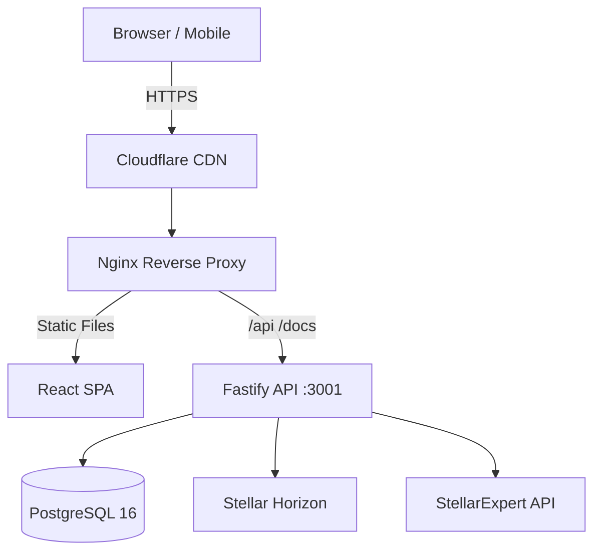

# Amma Wallet

A full-featured Stellar blockchain wallet with a modern web interface, self-custody and delegated signing modes, token discovery, DEX trading, and multi-language support.

**Live:** [https://ammawallet.com](https://ammawallet.com)
**API Docs:** [https://ammawallet.com/docs](https://ammawallet.com/docs)

---

## Project Overview

Amma Wallet is a monorepo with two packages. The backend is a Fastify REST API built with Node.js, TypeScript, PostgreSQL 16 via Drizzle ORM, and the Stellar SDK, serving 54 API endpoints. The frontend is a React 19 SPA built with Vite 6, Tailwind CSS 4, Zustand for state management, TanStack React Query, Recharts for price charts, and i18next supporting 18 languages. Infrastructure runs on AWS EC2 (ARM64) with Nginx, Let's Encrypt SSL, and Cloudflare DNS.

## Architecture

The backend package lives in packages/backend and contains the API server entry point (server.ts), database schema (db/), background jobs (jobs/), business logic modules (modules/), route handlers (routes/), middleware for JWT auth and Turnstile verification, and utility libraries for email, encryption, icon resolution, and the Stellar client. The frontend package lives in packages/web-app and contains lazy-loaded page components, reusable UI components (PriceChart, OrderbookDepth, NotificationBell, ThemeToggle, AccountSwitcher), Zustand stores for auth, wallet, theme, and notifications, 18 locale files for internationalization, and the API client library. Project documentation lives in the docs/ folder.

## Features

**Wallet Management** — Create multiple Stellar wallets with HD (BIP-39) mnemonic support. Import existing wallets via secret key or mnemonic. Switch, rename, or delete wallets. Choose self-custody mode (keys never leave the browser) or delegated mode (PIN-encrypted server signing).

**Token Discovery & Charts** — Browse 340+ tokens with server-side pagination (50 per page). Sort by trust score, name, volume, or holder count. Search by code, name, or domain. Token detail pages include OHLCV price charts with 1W/1M/3M/1Y intervals powered by Horizon trade aggregations, orderbook depth visualization, and liquidity pool information.

**Trading** — Swap tokens via the Stellar DEX with automatic path-finding. View price impact, exchange rates, and fees before confirming. Platform fee is configurable and applied on swaps only.

**Address Book** — Personal contact list per account. Save Stellar addresses with names, memos, and notes. Quick-send and copy actions. Contacts are isolated per user with no cross-account leakage.

**Security** — Email verification on signup, password reset flow with expiring tokens, two-factor authentication (TOTP authenticator, email codes, or backup codes), rate limiting (100 req/min global, 10/5min on auth), Cloudflare Turnstile on registration and login, JWT refresh token rotation with revocation, and PIN-encrypted wallet secrets in delegated mode.

**Notifications** — In-app notification center with bell icon and persistent storage via Zustand. Supports info, success, warning, and error types with mark-read, clear-all, and click-through navigation.

**Appearance** — Dark and light theme with CSS custom properties and instant toggle. Mobile-responsive design with hamburger menu and slide-out drawer. 18 languages including English, French, Spanish, Portuguese, Arabic (RTL), Chinese, Swahili, and 11 South African languages.

**Platform Operations** — Auto-liquifier converts non-XLM platform fees to XLM every 6 hours. Admin endpoints for manual liquification and balance checks. Token indexer syncs from Horizon and enriches metadata from StellarExpert on startup. Swagger/OpenAPI documentation for all 54 endpoints.

## Getting Started

Prerequisites are Node.js 20+, PostgreSQL 16+, and npm 10+. Clone the repository, then install dependencies in both packages/backend and packages/web-app with npm install. Copy .env.example to .env in the backend package and configure your database URL, JWT secrets, Stellar network settings, and SMTP credentials (see docs/DEPLOYMENT.md for all variables). Run npx drizzle-kit push to create the database schema. Start the backend with pm2 start "npx tsx src/server.ts" --name amma-backend. Build the frontend with npm run build in the web-app package, then serve the dist/ folder via Nginx.

## API Documentation

Interactive Swagger UI is available at [https://ammawallet.com/docs](https://ammawallet.com/docs) with all 54 endpoints documented. Key endpoint categories are Auth (register, login, refresh, logout, profile), Wallets (create, list, rename, delete, switch), Tokens (list, search, detail, price history, favorites), Trustlines (add, remove), Swap (quote, execute), Transactions (history, sign-and-submit), Contacts (CRUD), 2FA (setup, verify, disable), API Keys (create, list, revoke), and Admin (liquify, platform balance). See docs/API.md for the complete reference.

## Documentation

The docs/ folder contains ARCHITECTURE.md covering system design with Mermaid diagrams for auth flow, transaction signing, token enrichment pipeline, and database schema. MOSCOW.md has the MoSCoW feature prioritization with current status. API.md is the complete REST API reference with example requests and responses. DEPLOYMENT.md covers production setup including environment variables, Nginx configuration, SSL, backups, and monitoring. The in-app Help page at /help provides a user-facing FAQ with 19 items across 6 categories.

## License

Proprietary — SM Web Systems. All rights reserved.
