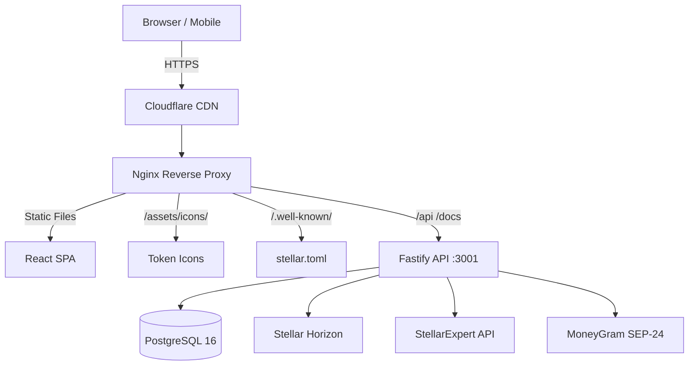

# Amma Wallet

A full-featured Stellar blockchain wallet with a modern web interface, self-custody and delegated signing modes, token discovery, DEX trading, fiat on/off ramp, liquidity pool earning, and multi-language support.

**Live:** [https://ammawallet.com](https://ammawallet.com)
**API Docs:** [https://ammawallet.com/docs](https://ammawallet.com/docs)

---

## Project Overview

Amma Wallet is a monorepo with two packages. The backend is a Fastify REST API built with Node.js, TypeScript, PostgreSQL 16 via Drizzle ORM, and the Stellar SDK, serving 82 API endpoints across 14 categories. The frontend is a React 19 SPA built with Vite 6, Tailwind CSS 4, Zustand for state management, TanStack React Query, Recharts for price charts, and i18next supporting 18 languages. Infrastructure runs on AWS EC2 (ARM64) with Nginx, Let's Encrypt SSL, and Cloudflare DNS.

## Architecture

The backend package lives in packages/backend and contains the API server entry point (server.ts), database schema (db/), background jobs (jobs/), business logic modules (modules/), route handlers (routes/) for earn, fiat, push notifications, MoneyGram, curated tokens, contacts, and portfolio, middleware for JWT auth and Turnstile verification, self-hosted token icons (assets/icons/), the curated token list (src/data/token-list.json with 24 mainnet and 7 testnet verified tokens), and utility libraries for email, encryption, icon resolution, and the Stellar client. The frontend package lives in packages/web-app and contains lazy-loaded page components (Dashboard, Tokens, TokenDetail, Send, Receive, Swap, Earn, BuySell, Portfolio, Contacts, Settings, Help), reusable UI components (PriceChart, OrderbookDepth, NotificationBell, ThemeToggle, AccountSwitcher, TokenIcon), Zustand stores for auth, wallet, theme, and notifications, a push notification service worker, 18 locale files for internationalization, a PWA manifest, and the stellar.toml for SEP-1 compliance. Project documentation lives in the docs/ folder.

## Features
Wallet Management — Create multiple Stellar wallets with HD (BIP-39) mnemonic support. Import existing wallets via secret key or mnemonic. Switch, rename, or delete wallets. Choose self-custody mode (keys never leave the browser) or delegated mode (PIN-encrypted server signing).

## Token Discovery & Charts
Browse 340+ tokens with server-side pagination (50 per page). Sort by trust score, name, volume, or holder count. Search by code, name, or domain. Curated token list with 24 mainnet and 7 testnet verified tokens, each with self-hosted icons served via Nginx with 30-day cache headers. Token detail pages include OHLCV price charts with 1W/1M/3M/1Y intervals powered by Horizon trade aggregations, orderbook depth visualization, and liquidity pool information.

## Trading
Swap tokens via the Stellar DEX with automatic path-finding. View price impact, exchange rates, and fees before confirming. Platform fee is configurable and applied on swaps only.

## Earn / Liquidity Pools
Browse available Stellar DEX liquidity pools with reserve details, fee rates, and provider counts. Filter pools by asset code. View your LP positions with share percentage and estimated value of each reserve. Deposit into and withdraw from pools via unsigned XDR transactions for client-side signing. Each pool charges 0.30% per trade, distributed proportionally to liquidity providers.

## Buy & Sell (Fiat Ramp)
MoneyGram cash-in and cash-out via SEP-10 authentication and SEP-24 interactive deposit/withdrawal protocol. Supports USDC deposits ($5-$950) and withdrawals ($5-$2,500) across 174 countries. Platform fee of 0.3% applied on fiat transactions. Built-in quote engine with live XLM/fiat rates for 7 currencies (USD, EUR, GBP, ZAR, NGN, KES, BRL). stellar.toml published at /.well-known/stellar.toml with dedicated SEP-10 signing keypair.

## Portfolio Analytics
Track portfolio value over time with balance snapshots stored in PostgreSQL. View 24-hour and 7-day change with trend indicators. Asset breakdown stored as JSONB for flexible reporting and charting.

## Address Book
Personal contact list per account. Save Stellar addresses with names, memos, and notes. Quick-send and copy actions. Contacts are isolated per user with no cross-account leakage.

## Security
Email verification on signup, password reset flow with expiring tokens, two-factor authentication (TOTP authenticator, email codes, or backup codes), rate limiting (100 req/min global, 10/5min on auth), Cloudflare Turnstile on registration and login, JWT refresh token rotation with revocation, and PIN-encrypted wallet secrets in delegated mode.

## Push Notifications
Web push via VAPID keys and service worker. Subscribe and unsubscribe from the Settings page. Notification subscription endpoints store device registrations in PostgreSQL. In-app notification center with bell icon and persistent Zustand storage supports info, success, warning, and error types with mark-read, clear-all, and click-through navigation.

## Appearance
Dark and light theme with CSS custom properties and instant toggle. Mobile-responsive design with hamburger menu and slide-out drawer. 18 languages including English, French, Spanish, Portuguese, Arabic (RTL), Chinese, Swahili, and 11 South African languages.

## Platform Operations 
Auto-liquifier converts non-XLM platform fees to XLM every 6 hours. Admin endpoints for manual liquification and balance checks. Token indexer syncs from Horizon and enriches metadata from StellarExpert on startup. Self-hosted token icons (10 PNG downloaded from official sources, 15 SVG generated with branded colors) with resolveIconUrl() prioritizing local icons over TOML images. Swagger/OpenAPI documentation for all 82 endpoints. stellar.toml published for SEP-1 compliance and MoneyGram integration.

## Getting Started
Prerequisites are Node.js 20+, PostgreSQL 16+, and npm 10+. Clone the repository, then install dependencies in both packages/backend and packages/web-app with npm install. Copy .env.example to .env in the backend package and configure your database URL, JWT secrets, Stellar network settings, SMTP credentials, VAPID keys for push notifications, and MoneyGram ramps configuration (see docs/DEPLOYMENT.md for all variables). Run npx drizzle-kit push to create the database schema. Start the backend with pm2 start "npx tsx src/server.ts" --name amma-backend. Seed curated tokens by calling POST /api/v1/tokens/curated/seed after the server is running. Build the frontend with npm run build in the web-app package, then serve the dist/ folder via Nginx.

## API Documentation
Interactive Swagger UI is available at https://ammawallet.com/docs with all 82 endpoints documented. Key endpoint categories are Auth (register, login, refresh, logout, profile, password reset), Wallets (create, list, rename, delete), Tokens (list, search, detail, price history, favorites, curated list, seed), Trustlines (add, remove, check, update limit), Swap (quote, build), Transactions (history, sign, sign-and-submit, submit), Contacts (CRUD), Earn (pools, positions, deposit, withdraw), Fiat Ramp (currencies, quotes, buy, sell), MoneyGram (info, deposit, withdraw, transaction status), Portfolio (snapshot, history, summary), Push Notifications (VAPID key, subscribe, unsubscribe, test), 2FA (setup, verify, disable, backup codes), API Keys (create, list, revoke), Keypair utilities (generate, from-mnemonic, from-secret, validate), Signing mode (get, set), and Admin (liquify, platform balance). See docs/API.md for the complete reference.

## Documentation
The docs/ folder contains ARCHITECTURE.md covering system design with Mermaid diagrams for auth flow, transaction signing, token enrichment pipeline, and database schema. MOSCOW.md has the MoSCoW feature prioritization with current status across v1.0 (20 must-have features complete), v1.1 (14 should-have features complete), v1.2 (4 could-have features complete), and planned v2.0 (SEP-24 anchor platform, custom fiat corridors, multi-chain bridge, Soroban contracts, native mobile apps). API.md is the complete REST API reference with all 82 endpoints organized by category. DEPLOYMENT.md covers production setup including environment variables, Nginx configuration, SSL certificates, database backups, monitoring, and mainnet migration steps. The in-app Help page at /help provides a user-facing FAQ with 27 items across 6 categories.

## License
Proprietary — SM Web Systems. All rights reserved.