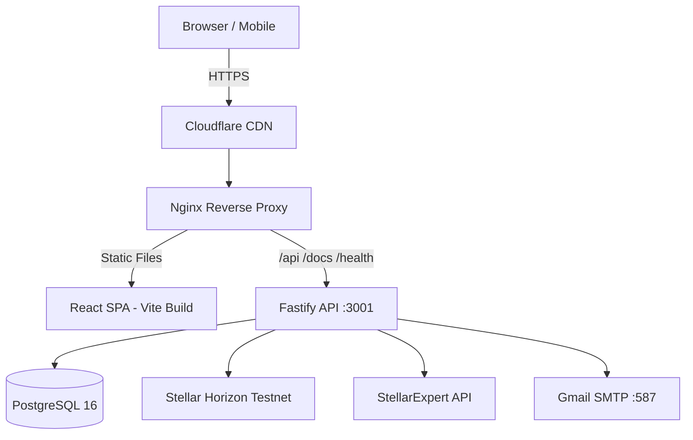
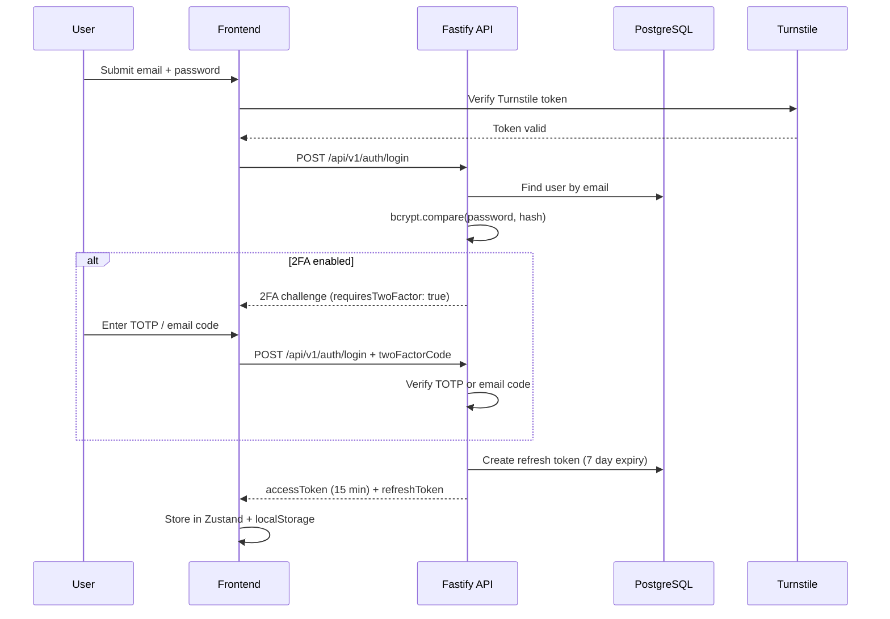
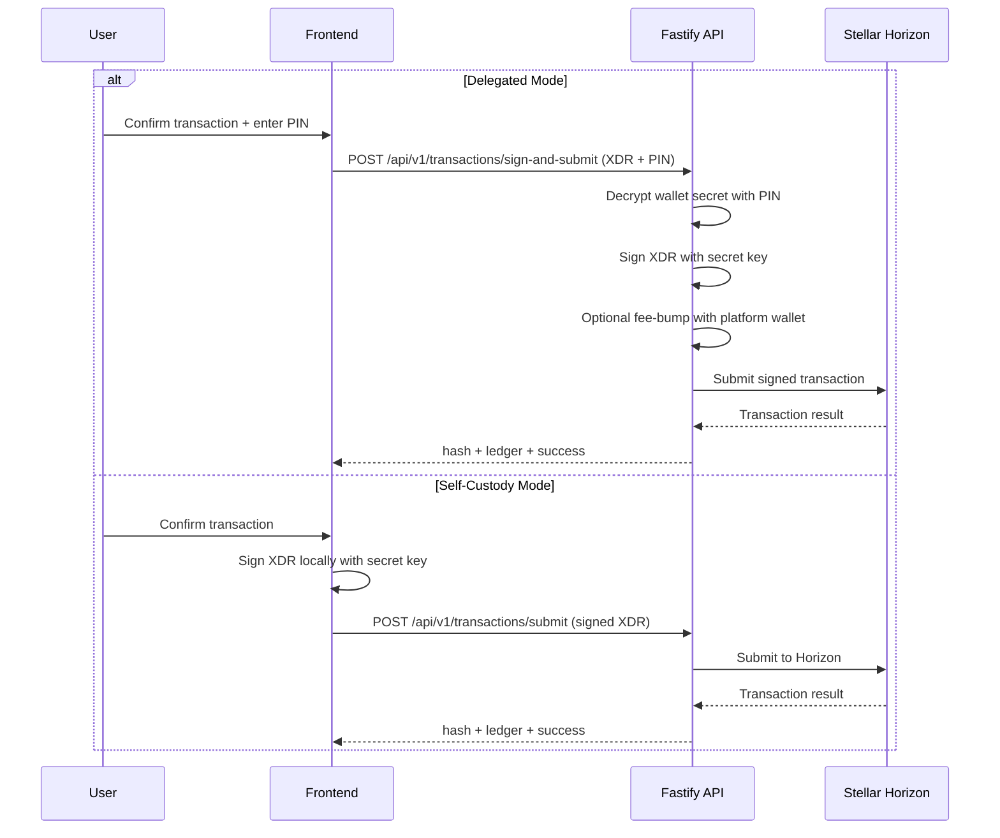
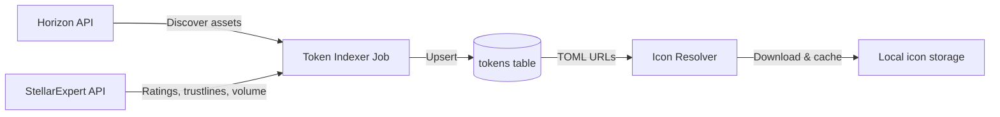
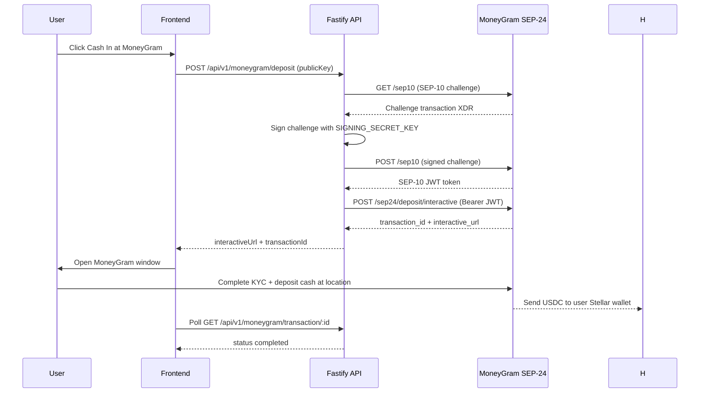
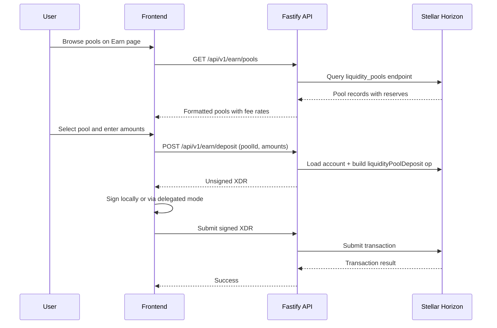
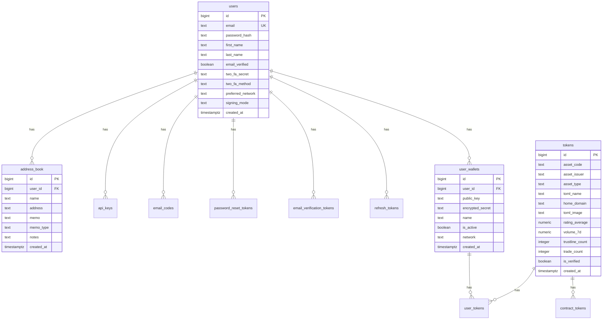

# Architecture

## System Overview

The system runs on a single AWS EC2 instance (ARM64, Ubuntu 24.04) in the af-south-1 (Cape Town) region. Cloudflare handles DNS and CDN. Nginx terminates SSL via Let's Encrypt and serves the React SPA static files directly while proxying API requests to the Fastify server on port 3001. The backend communicates with PostgreSQL for persistent storage, Stellar Horizon for blockchain operations, StellarExpert for token metadata enrichment, and Gmail SMTP for transactional emails.

## Authentication Flow

Registration follows a similar flow with email verification. A verification token is emailed to the user, and the account remains unverified until they click the link. Password reset uses a separate token with a 1-hour expiry. Rate limiting applies 10 requests per 5 minutes on all auth endpoints and 100 requests per minute globally.

## Transaction Signing

In delegated mode the user's wallet secret is stored encrypted with their PIN using AES-256. The secret is only decrypted momentarily during signing and never logged or cached. In self-custody mode the secret key exists only in the browser and the server never sees it.

## Token Enrichment Pipeline

The token indexer runs on backend startup. It first discovers assets from Stellar Horizon, then enriches each token with metadata from StellarExpert (ratings, trustline counts, trade counts, volume, home domain). The enricher is network-aware, querying the testnet or public StellarExpert endpoint based on the STELLAR_NETWORK configuration. It paginates through up to 500 tokens per run. After enrichment, the icon resolver fetches token logos from stellar.toml files and caches them locally.

## MoneyGram Fiat Ramp Flow

MoneyGram Ramps provides fiat on/off ramp for USDC on Stellar via the SEP-10 (authentication) and SEP-24 (interactive deposit/withdrawal) protocols. The server authenticates with MoneyGram using a dedicated signing keypair (SIGNING_PUBLIC_KEY published in stellar.toml at /.well-known/stellar.toml). On-ramp limits are $5-$950 per transaction, off-ramp limits are $5-$2,500, available in 174 countries. A platform fee of 0.3% is applied on all fiat transactions. The stellar.toml passes the Stellar TOML Checker validation and includes the organization details, signing key, SEP-24 transfer server URL, and USDC currency definition.

Liquidity Pool / Earn Flow

The Earn feature allows users to provide liquidity to Stellar DEX constant-product pools and earn a share of trading fees. Each pool charges 0.30% (30 basis points) per trade, distributed proportionally to liquidity providers based on their share of the pool. The backend builds unsigned XDR transactions for deposits and withdrawals, which are signed client-side (self-custody) or server-side (delegated mode) before submission. User positions are calculated by querying their liquidity_pool_shares balances from Horizon and computing ownership ratios against total pool shares.

## Database Schema

Additional tables include refresh_tokens (JWT refresh token storage with expiry and revocation), email_verification_tokens, password_reset_tokens (1-hour expiry), email_codes (for 2FA email verification), api_keys (hashed keys with optional expiry), contract_tokens (Soroban SAC contract mappings), user_tokens (per-user token preferences and favorites), tx_history (cached transaction records), liquidity_pools, and sync_state (cursor tracking for token enrichment).

## Security Architecture

Authentication uses bcrypt with 12 salt rounds for password hashing. JWT access tokens expire after 15 minutes and refresh tokens after 7 days with automatic rotation. Two-factor authentication supports three methods: TOTP (authenticator apps like Google Authenticator), email codes (6-digit codes sent via SMTP), and static backup codes (generated on 2FA setup). Wallet secrets in delegated mode are encrypted with the user's PIN using AES-256-GCM and are only decrypted during transaction signing. Rate limiting enforces 100 requests per minute globally and 10 requests per 5 minutes on authentication endpoints. CORS is configured with an explicit origin allowlist. Cloudflare Turnstile protects registration and login forms from automated abuse. The SEP-10 signing key is stored server-side and used only for MoneyGram authentication challenges.

## Frontend Architecture

The React SPA uses code splitting with React.lazy to keep the initial bundle small. Page components (Dashboard, Tokens, TokenDetail, Send, Receive, Swap, Earn, BuySell, Portfolio, Contacts, Settings, Help) are all lazy-loaded. Vendor dependencies are split into separate chunks: vendor-react, vendor-stellar (loaded only when needed), vendor-icons, vendor-query, and vendor-i18n. The initial page load is approximately 170 KB gzipped. State management uses Zustand with three persisted stores (auth, wallet, notifications) and one non-persisted store (theme reads from localStorage). Server state is managed by TanStack React Query with automatic cache invalidation. Routing uses React Router v7 with protected route wrappers that redirect unauthenticated users to the login page. The Sonner library provides toast notifications throughout the application. A service worker (public/sw.js) handles web push notification display and click-through navigation. The PWA manifest enables add-to-home-screen on mobile devices. Internationalization uses i18next with 18 locale files covering English, French, Spanish, Portuguese, Arabic (RTL), Chinese, Japanese, Korean, Hindi, Swahili, and 8 additional languages.
