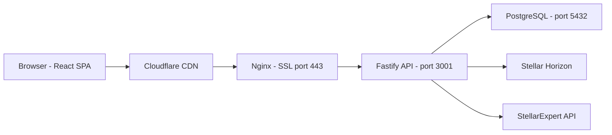
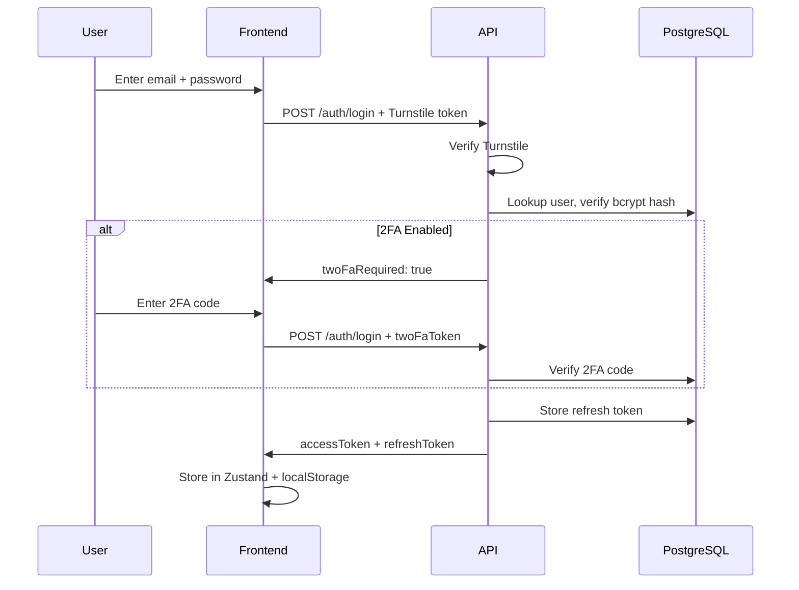
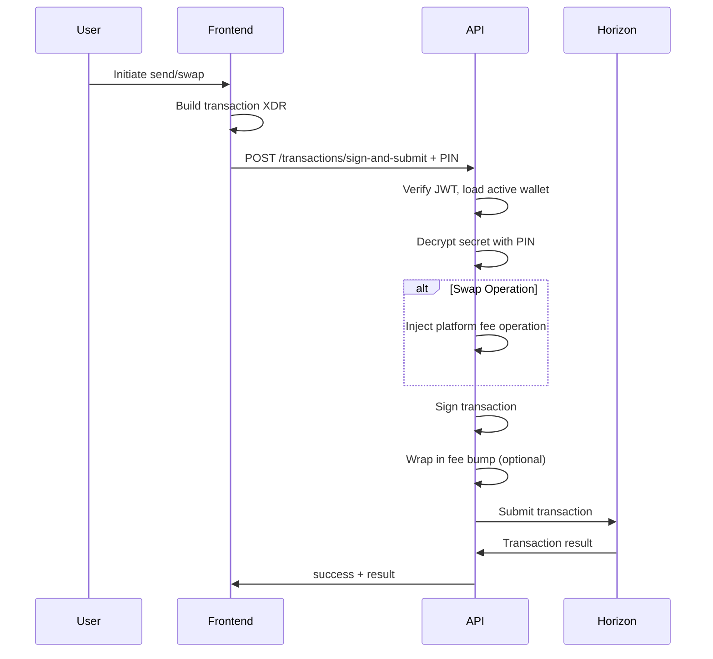
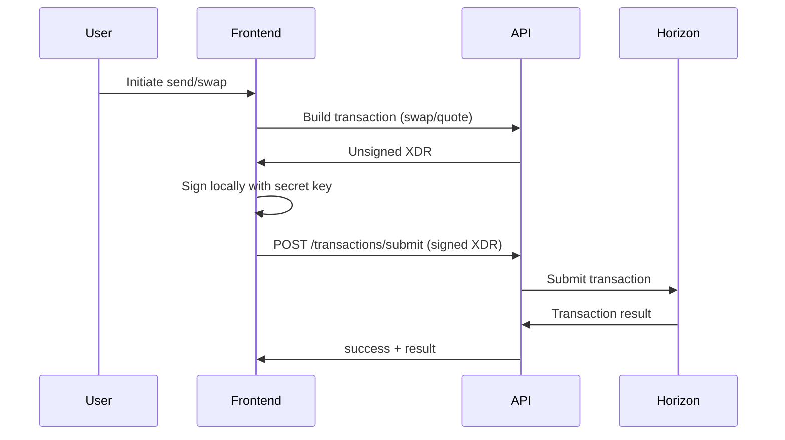
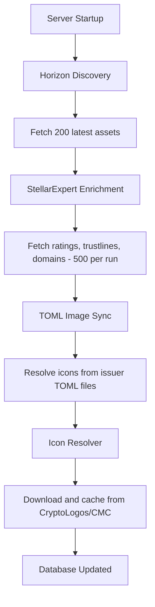
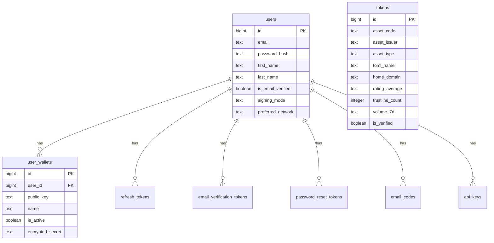

# Architecture

## System Overview

## Authentication Flow

## Transaction Flow (Delegated Mode)

## Transaction Flow (Self-Custody Mode)

## Token Enrichment Pipeline

## Database Schema

## Security Architecture

Authentication:
- Passwords hashed with bcrypt (12 rounds)
- JWT access tokens: 15-minute expiry, signed with HS256
- JWT refresh tokens: 7-day expiry, stored in DB, single-use rotation
- Logout revokes refresh token; password change revokes all tokens

2FA Methods:
- TOTP -- standard authenticator app (Google Authenticator, Authy)
- Email -- 6-digit code sent via SMTP, 10-minute expiry
- Static Code -- pre-shared code hashed with SHA-256
- Backup Codes -- 10 one-time codes, hashed, removed after use

Wallet Security (Delegated Mode):
- Wallet secret encrypted with user PIN before storage
- PIN never stored; used only at signing time to decrypt
- Decryption failure returns 403 (invalid PIN)
- Secret key material held in memory only during signing operation

Rate Limiting:
- Global: 100 requests per minute per IP
- Auth endpoints: 10 per 5 minutes
- Based on X-Forwarded-For header (behind Nginx/Cloudflare)

## Frontend Architecture

Code Splitting: All page components lazy-loaded via React.lazy(). Vendor chunks split for stellar SDK (256KB gz), react (67KB gz), icons, query, i18n, polyfills. Initial load approximately 170KB gzipped.

State Management: Zustand for auth and wallet state. React Query for server state (tokens, balances, history).

Routing: React Router v7 with layout components. Protected routes require authentication.
